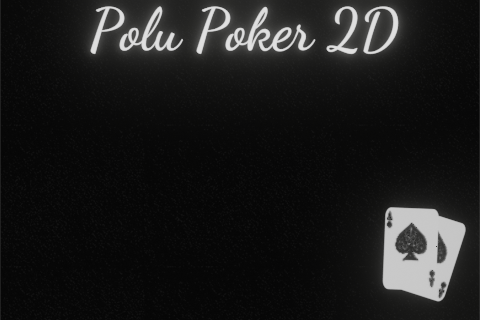
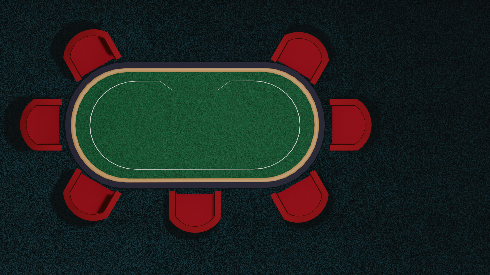

# polu-pocker2D

Python single-user pocker via PyGame and custom graphics

## Requirements

1. PyGame ~= 2.5.0

## Usage

Just run ```main.py```

```bash
    python -m main
```

## Example screens

### Menu (Background)



### Desk

